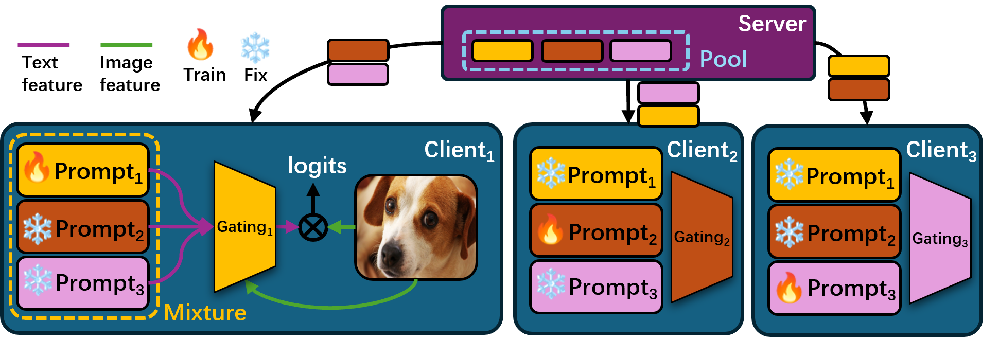
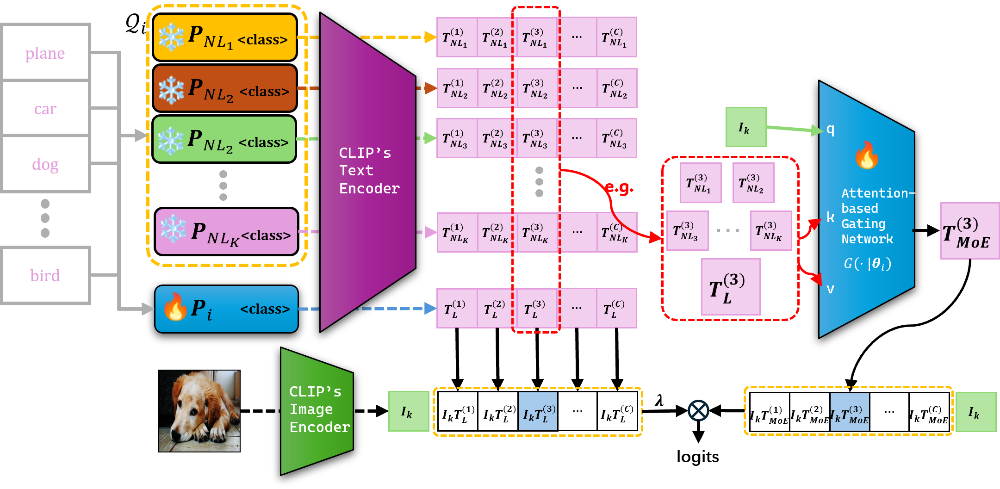

# Mixture of Experts Made Personalized: Federated Prompt Learning for Vision-Language Models

This repository contains the code and experiemnts for the [ICLR 2025](https://iclr.cc/Conferences/2025) paper: [Mixture of Experts Made Personalized: Federated Prompt Learning for Vision-Language Models](https://arxiv.org/abs/2410.10114) (see also the [project page](https://ljaiverson.github.io/fl-projects/#pfedmoap)). This implementation is greatly inspired by [FedOTP repo](https://github.com/HongxiaLee/FedOTP). Shout out to its contributors!



<p align="center"><em>Figure 1: Global pipeline of pFedMoAP</em></p>


<p align="center"><em>Figure 2: Client workflow of pFedMoAP</em></p>

## Abstract

Federated prompt learning benefits federated learning with CLIP-like Vision-Language Model's (VLM's) robust representation learning ability through prompt learning. However, current federated prompt learning methods are habitually restricted to the traditional FL paradigm, where the participating clients are generally only allowed to download a single globally aggregated model from the server. While justifiable for training full-sized models under federated settings, in this work, we argue that this paradigm is ill-suited for lightweight prompts. By facilitating the clients to download multiple pre-aggregated prompts as fixed non-local experts, we propose Personalized Federated Mixture of Adaptive Prompts (pFedMoAP), a novel FL framework that personalizes the prompt learning process through the lens of Mixture of Experts (MoE). pFedMoAP implements a local attention-based gating network that learns to generate enhanced text features for better alignment with local image data, benefiting from both local and downloaded non-local adaptive prompt experts. Extensive experiments on 9 datasets under various federated settings demonstrate the efficacy of the proposed pFedMoAP algorithm.


## Requirements
This implementation is base on  `Python>=3.10.6` environment. To install the dependent packages for this implementation for `Python 3.10.6` environment, run
```bash
pip install -r requirements.txt
```

## Datasets preparation
All datasets are suggested to be downloaded in `dataset` folder.

For CLIP datasets, namely Caltech101, OxfordPets, Flowers102, Food101, and DTD, please refer to the instructions in [dataset.md](dataset/dataset.md) to set up the datasets.

For CIFAR10 and CIFAR100, the datasets will be downloaded automatically when running experiments.

For DomainNet and office-caltech10 datasets, please download the pre-processed Office-Caltech10 from [here](https://mycuhk-my.sharepoint.com/:u:/g/personal/1155149226_link_cuhk_edu_hk/EaBgx5UmvatMi0KdvfdLWsABC49vcjZ2n9oZkjwl8jPMyA?e=TDxqN5), and DomainNet from [here](https://mycuhk-my.sharepoint.com/:u:/g/personal/1155149226_link_cuhk_edu_hk/EUTZ_Dr9YnxLm_cGvjXJGvEBJtKUn_LxpFs9DZ2ZVS-eaw?e=N8ajKz) (refered to [FedBN repo](https://github.com/med-air/FedBN/blob/master/README.md)).

## Running experiments

To run the experiments, as an example, running the comman below (with default arguements) will start a few-shot learning experiment over `food101` dataset.

```
python federated_main.py
```


The script `federated_main.py` can be executed with specific flags to start training. The most important ones are listed in `train.sh`. The experiments can also be conducted in bash with
```
sh train.sh
```

To change dataset, change the `DATASET` variable in `train.sh`. It will automatically include the `configs/datasets/oxford_pets.yaml` as the dataset config file with the `--dataset-config-file` flag when running the python script. To run on experiments with a dataset not included in the `configs/datasets/`, please create your own config file in this directory.

For algorithm and model specific flags, e.g. pFedMoAP with ResNet50, please change it in `config/trainers/PFEDMOAP/rn50.yaml`. If the same flag has different values, trainer config overwrites dataset config, which both have higher priority than python args.


## Citation
If you find our work useful in your research, please consider citing:
```
@article{luo2024mixture,
  title={Mixture of Experts Made Personalized: Federated Prompt Learning for Vision-Language Models},
  author={Luo, Jun and Chen, Chen and Wu, Shandong},
  journal={arXiv preprint arXiv:2410.10114},
  year={2024}
}
```